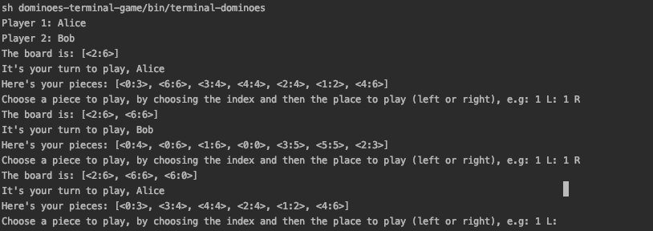
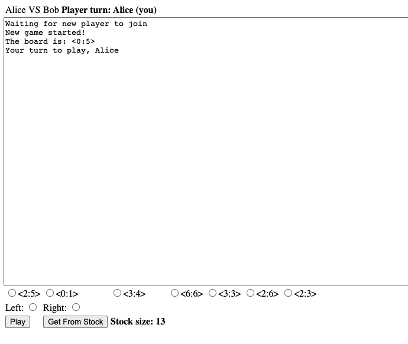
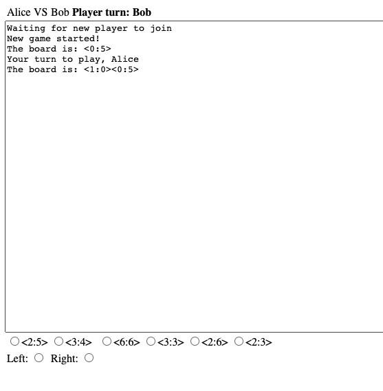
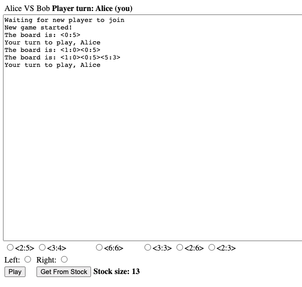
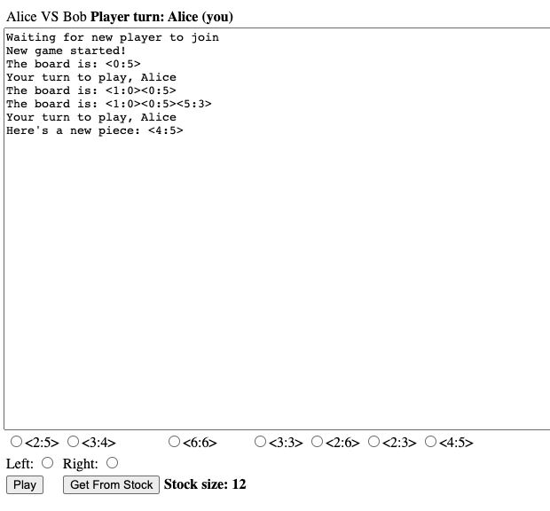
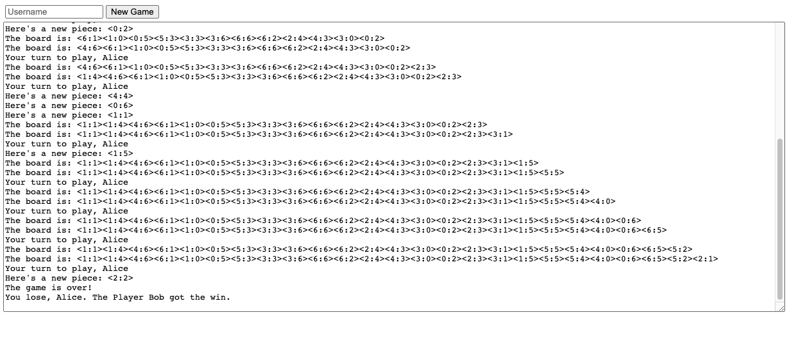
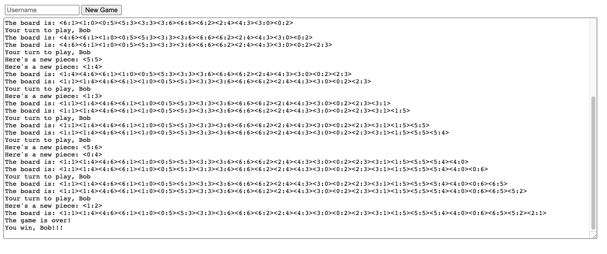

# Dominoes

This project is a 2 player dominoes game written in java. 
The idea was to construct a library that can be extended and used to perform a dominoes game. 
Adding to that, I created two implementations of the game, one in the terminal and the other one as a web application. 

# Structure

This project it's structured into three parts:
* **dominoes-lib**: contains all tools necessary to perform a dominoes game
* **dominoes-terminal**: it contains a solution for the game in a terminal mode, where players play in the same machine
* **dominoes-browser**: it contains a web application, developed with WebSockets. Players can play in different machines

## Dominoes Lib
This module represents a library to roll out a dominoes game.
It contains the core code of the game, and it may be extended or included to create a new dominoes game, with the necessary logic.

### Entities
The following entities are available in this library:
* **Player**: represents a player; it has a name and a set of pieces (DominoPiece), available to be played
* **DominoPiece**: represents a domino piece. The piece has a left side and a right side and some useful methods (e.g check if some piece is playable with this piece). Note: left and right sides are integers that must be defined in the interval [0,6].
* **Game**: represents the game itself. Contains the board (line of play, a set of pieces lined in), the stock (to get pieces from), and the players in the game.

### Usage
To use it, you need to:
1. Include the maven dependency in your project:
```xml
<parent>
    <artifactId>dominoes-lib</artifactId>
    <groupId>org.jpires.dominoes</groupId>
    <version>1.0-SNAPSHOT</version>
</parent>
```
2. Construct a game object, with the players or their names:
```java
    Game game = new Game("player1", "player2")
```
Or
```java
    Player player1 = new Player("player1");
    Player player2 = new Player("player2");
    Game game = new Game(player1, player2);
```
This operation will create a new game, with a shuffled stock and an empty board 
3. Then, you need to start the game:
```java
    game.start();
```
By default, the game starts with 7 pieces for each player, but it's possible to start a game with a configured number of pieces for each player:
```java
    //5 pieces for each player
    game.start(5);  
```
At the starting of the game, the dominoes pieces are distributed from the stock to the players. A domino piece is added to the board as well. In this method, we designate a player to start the game (player 1).

To know more about the library (available classes and methods) verify javadoc:
On the project root run `make javadoc` or `mvn javadoc:jar`. The docs will be available on `dominoes-lib/target/apidocs`.

## Dominoes Terminal
This module represents a terminal implementation of the dominoes game. Using the dominoes-lib, I created a terminal application, where it's possible to play on the terminal with two players.

Here's a sample game:



## Dominoes Browser
This module represents a web application of the dominoes game. 
It was done using websockets, where the browser receives messages with the current board, and the server receives messages with the players' moves.
To play a dominoes game in the browser is much more interactive, easy, and fun to play. 
For example, it's possible to choose directly the pieces we want to play instead of sending "codes" to the terminal. 
It's also better for a two players game since each player can play on his computer without showing his game to the opponent.

Here's a sample game:



# How to Build
## Requirements
* jdk 8
* maven 3
* docker (required for browser version)

## Build
This project is buildable with a Makefile. 

To Compile all the code quickly (without run unit tests) use one of the following options: 
* `make install-quick`
* `mvn clean install -DskipTests`

To Compile the code and run unit tests use one of the following options:
* `make install`
* `mvn clean install`

To run only unit tests use one of the following options:
* `make test`
* `mvn test`

To create javadoc use one of the following options:
* `make javadoc`
* `mvn javadoc:jar`


# How to Run
## Dominoes Terminal
To run the terminal version of dominoes you can:
* `make run-terminal`

OR
```
# Compile all project with: 
mvn clean install -DskipTests
# Go to dominoes-terminal/target and untar the archive dominoes-terminal-1.0-SNAPSHOT-dist.tar.gz 
# Go to the extracted folder and run:
sh bin/terminal-dominoes 
```

## Dominoes Browser
The browser implementation runs in docker with a base image of jetty.

To run it just:
* `make docker-build docker-start`

OR
* `mvn clean install -DskipTests && docker-compose up -d`

Here's the Makefile options for docker:
* `docker-start`: starts (and creates) only the container, without building the project
* `docker-stop`: stops the container
* `docker-remove`: removes the container
* `docker-build`: rebuilds the project and the docker image
* `docker-quick-deploy`: quick deploy on the docker container (compiles the project and copies the dependencies)

# How to Play
## Dominoes Terminal
To play the game on terminal:
1. Write the players' names (player 1 and player 2)
1. It will be the player 1 turn. To play a piece you need to select the index of the piece (0-X) 
and the place where do you want to play it (e.g 1 L, will be the 2nd piece of your "hand", to be played on the left side of the board (beginning))
1. After successfully played, the game will switch the turn to player 2. Player 2 can perform a move now.
1. If a player don't have any valid piece to play, the game will automatically give pieces from the stock to the player until 
he has a valid piece to play. Here's an example:
`You don't have any options to play. Here's a new piece`
1. The game will be over if:\
One of the players don't have any pieces to play\
The stock is empty and no one has any valid pieces to be played on the board
1. Finally, the game designates the winner of the game and it prompts to the console. 

## Dominoes Browser
To play the game on browser:
1. Open the link http://localhost:8080/dominoes-browser/
1. Write your name in Username and click on "New Game"
1. Wait for a new player to join your session
1. Open the same link in another tab and write a different name and click on "New Game"
1. The game was started and the first player entered in the session owns the turn. 

You will see a screen like this:


To play just select a piece and a side, for example "<0,1>", "Left" and click on the play:



Now it's the Bob's turn, so you got the board updated with the played piece, but you need to wait for Bob's play.
Once Bob's played, you got the turn again, and the board is updated with the piece he played: 



If you need a piece from stock just click on the button "Get From Stock". You will see the stock size decreasing and your "hand" increasing:



If the stock reaches to 0 pieces and you don't have any valid piece to play, just click again on "Get From Stock". You will lose the turn to play.
When the game is finished, the New Game and the text box will appear again, just to start a new game, and the winner is announced:

Alice's screen:



Bob's screen:



In the example game, Bob was the winner.

# Things to Improve

* There is a small bug where players can have the same name; in that case they both wins
* Web browser game graphics. You know, I'm not a CSS / HTML ninja ;) 
* Javascript code and documentation on that
* Unit / Integration tests for browser and terminal versions of the game
* Make the browser game scalable: use RabbitMQ to manage the players waiting to play and Redis to have a distributed cache with the game sessions
* Security: e.g: the players' moves can be signed with a token to guarantee that the player really made that move
* Save the session in the browser: now if I close the tab, I'll lose the game session.
